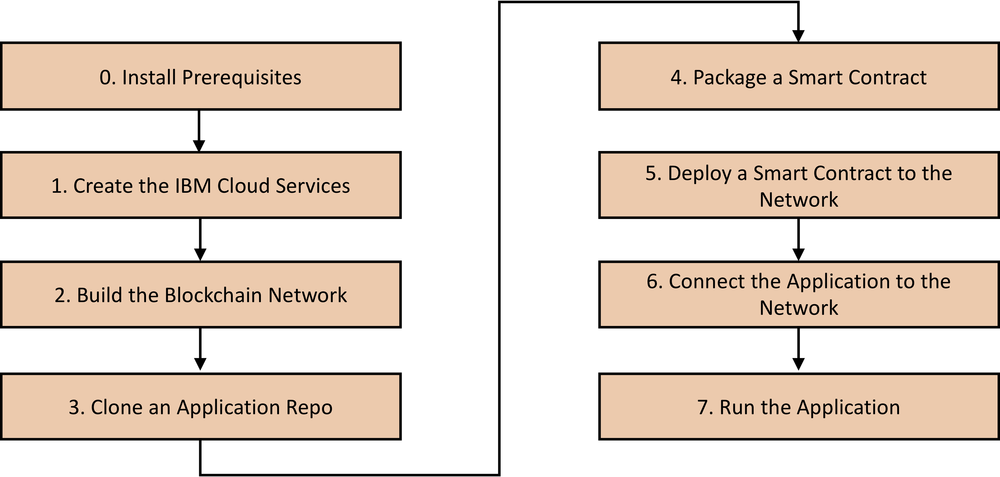

# Getting Started with IBM Blockchain Platform Version 2
This tutorial shows you how to get started with the IBM Blockchain Platform version 2. The aim is to walk you through each step of the process, showing how you get a blockchain application running on an enterprise grade Hyperledger Fabric platform. Here are the steps we will be following:

This tutorial does _not_ cover the actual development of an application. There are various example applications that you can use and I'll suggest some you can deploy and where you can find them.

IBM Blockchain Platform is currently in free beta so this tutorial applies to that version. It will be updated as the platform moves to General Availabilty (GA).

IBM Blockchain Platform v2 differs from v1 in that it is now deployed into Kubernetes clusters using the IBM Kubernetes Service (IKS). This is good news and bad news. Whilst you get far more control of the underlying container resources it also means you need a greater understanding of: Kubernetes, Docker (one of the container technologies that Kubernetes supports) as well as the IBM Cloud command line interface. The prerequisites step ensures you have all the tools and command lines you need to use these technologies.

- [Step 0 - Install Prerequisites](docs/prereqs.md)

If you have everything set up correctly you should see this screen showing information on your Kubernetes cluster...

...and this screen showing your IBP console.

You are now ready to build a blockchain network which you can do by following [this tutorial](https://cloud.ibm.com/docs/services/blockchain/howto?topic=blockchain-ibp-console-build-network#ibp-console-build-network). At the end of this you should have a network that resembles the one in the diagram below.

Once you have a running IBP v2 network you can go ahead and deploy a smart contract on the network by following [this tutorial](https://cloud.ibm.com/docs/services/blockchain/howto?topic=blockchain-ibp-console-smart-contracts#ibp-console-smart-contracts).

If you want to use an existing smart contract rather than build one yourself [this code pattern](https://developer.ibm.com/patterns/write-a-smart-contract-for-the-fabcarcommercial-paper-or-iks-cluster-with-saas-v2-beta-network-think/) demonstrates setting up a network on the IBM Blockchain Platform 2.0 and deploying the Fabcar smart contract on the network. 

Other existing applications can be found [here](https://cloud.ibm.com/docs/services/blockchain/howto?topic=blockchain-ibp-console-app#ibp-console-app).