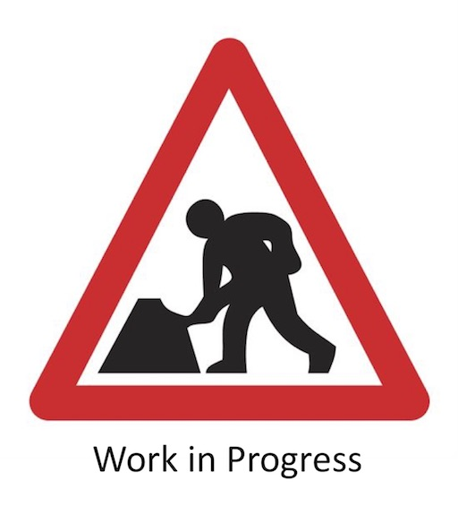
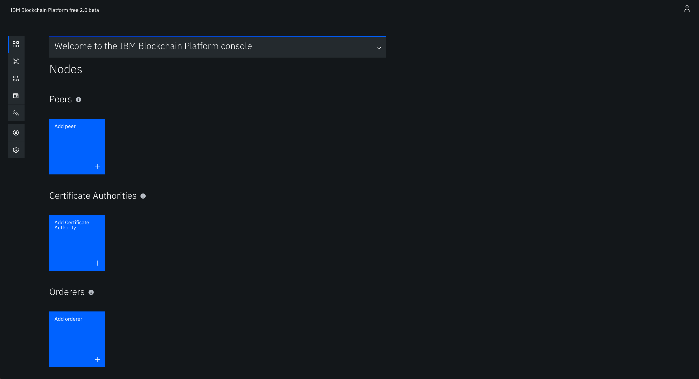

# Step 2 - Build the Blockchain Network

Once you have built and instantiated your blockchain platform onto a Kubernetes cluster you should have this screen showing your IBP console.

Once you have a running IBP v2 network you can go ahead and deploy a smart contract on the network by following [this tutorial](https://cloud.ibm.com/docs/services/blockchain/howto?topic=blockchain-ibp-console-smart-contracts#ibp-console-smart-contracts).

If you want to use an existing smart contract rather than build one yourself [this code pattern](https://developer.ibm.com/patterns/write-a-smart-contract-for-the-fabcarcommercial-paper-or-iks-cluster-with-saas-v2-beta-network-think/) demonstrates setting up a network on the IBM Blockchain Platform 2.0 and deploying the Fabcar smart contract on the network. 

Other existing applications can be found [here](https://cloud.ibm.com/docs/services/blockchain/howto?topic=blockchain-ibp-console-app#ibp-console-app).

Now you have a running blockchain network on the IBM Cloud platform you can proceed to [Step 3 - Clone an Application Repo](../docs/clonerepo.md).