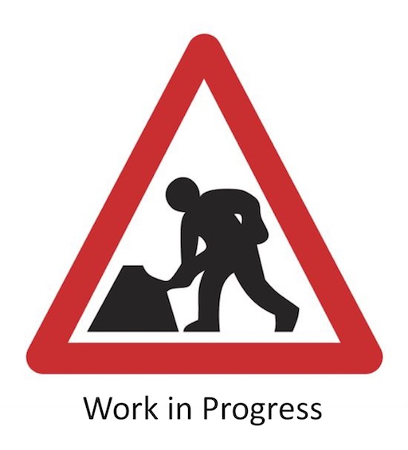

# Step 1 - Create IBM Cloud Services

If you have everything set up correctly you should see this screen showing information on your Kubernetes cluster...

You are now ready to build a blockchain network which you can do by following [this tutorial](https://cloud.ibm.com/docs/services/blockchain/howto?topic=blockchain-ibp-console-build-network#ibp-console-build-network). At the end of this you should have a network that resembles the one in the diagram below.

Now you have a Kubernetes service up and running you can move to [Step 2 - Build the Blockchain Network](../docs/buildnetwork.md).